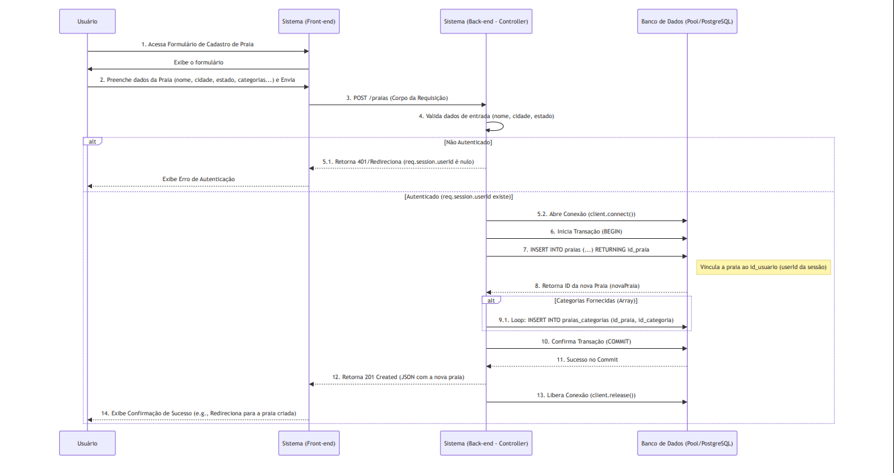
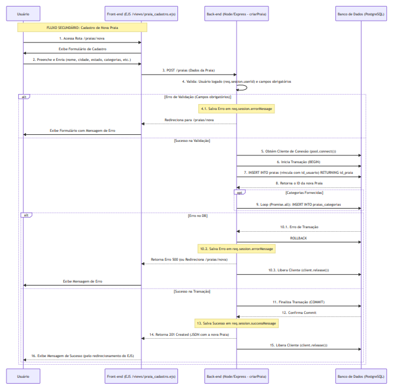
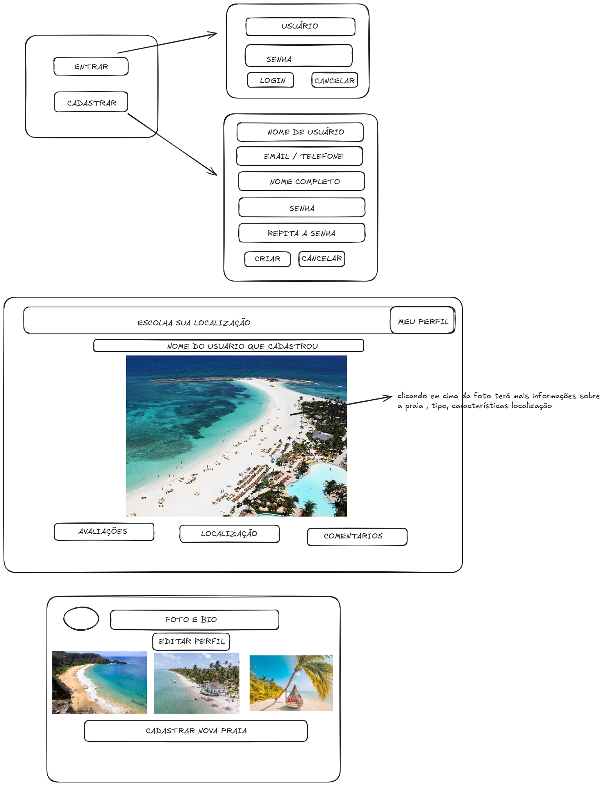
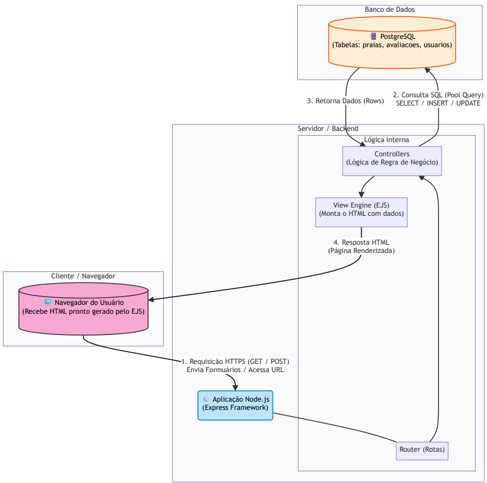
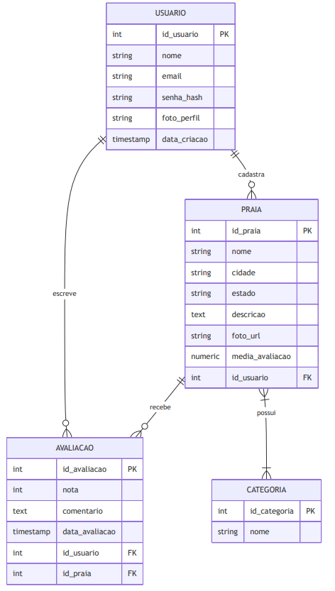

# Guia de Praias — Descubra e Avalie Praias

## 1) Problema

Turistas e moradores, em qualquer região litorânea, têm dificuldade em descobrir e avaliar praias de forma confiável.
Isso causa perda de tempo e experiências ruins, já que as informações estão espalhadas ou são incompletas.
No início, o foco será **usuários que buscam praias para lazer**, com o objetivo de **organizar informações e permitir avaliações confiáveis**.

## 2) Atores e Decisores

Usuários principais: Turistas, Moradores, Amantes de praia
Decisores/Apoiadores: Administradores do sistema, Coordenadores do projeto

## 3) Casos de uso

Todos: Logar/deslogar do sistema; Manter dados cadastrais
Usuário: Manter (inserir, mostrar, editar, remover) avaliações; visualizar ranking e categorias de praias
Administrador (opcional): Manter (inserir, mostrar, editar, remover) praias e categorias

## 4) Limites e suposições

Limites: Entrega final até o fim da disciplina; rodar no navegador; sem serviços pagos obrigatórios
Suposições: Internet disponível; navegador atualizado; acesso ao GitHub; 10 min para teste rápido
Plano B: Sem internet → rodar local e salvar em LocalStorage; sem tempo do professor → testar com 3 colegas

## 5) Hipóteses + validação

H-Valor: Se os usuários visualizarem praias com categorias e rankings, então escolhem melhores praias de forma mais rápida e confiável
Validação (valor): Teste com 5 usuários; sucesso se ≥4 encontrarem praias relevantes sem ajuda

H-Viabilidade: Com HTML/CSS/JS + backend simples (Node.js/Express ou similar), criar e listar praias e avaliações leva até 1 segundo
Validação (viabilidade): Medição no protótipo; meta: 1s ou menos na maioria das vezes (≥9/10)

## 6) Fluxo principal e primeira fatia (atualizado)

**Fluxo principal (curto):**

1. Usuário faz login
2. Seleciona **localização desejada**
3. Lista de praias filtrada aparece, com categorias e ranking
4. Usuário pode **visualizar detalhes** ou **avaliar a praia** na mesma tela
5. Sistema salva avaliação (se aplicável)
6. Ranking e média de notas são atualizados automaticamente

**Primeira fatia vertical (escopo mínimo):**
Inclui: Tela de login, lista de praias com filtro por localização, cadastrar avaliação na mesma tela
Critérios de aceite:

* Usuário consegue se autenticar e sair da sessão
* Lista de praias aparece apenas para a localização selecionada
* Avaliação criada aparece imediatamente no ranking

**Fluxo principal (curto):**  

**Fluxo secundário (longo):**  

## 7) Esboços de algumas telas (wireframes) (atualizado)

* Login
* Lista de praias (com filtro de **localização**, categorias e ranking)

  * Cada praia pode ser clicada/expandida para mostrar detalhes e avaliação na mesma tela
* Perfil do usuário (avaliações feitas, praias cadastradas)
  \[Links ou imagens dos seus rascunhos de telas aqui]

## 8) Tecnologias

### 8.1 Navegador

**Navegador:** HTML/CSS/JS (+ Bootstrap ou Tailwind)
**Armazenamento local:** LocalStorage (opcional)
**Hospedagem:** GitHub Pages (frontend)

### 8.2 Front-end (servidor de aplicação)

**Front-end (servidor):** React ou Next.js
**Hospedagem:** Vercel

### 8.3 Back-end (API/servidor)

**Back-end (API):** Node.js + Express
**Banco de dados:** PostgreSQL ou MongoDB
**Deploy do back-end:** Render ou Railway

**Integração das Tecnologias:**  

## 9) Plano de Dados (Dia 0) — somente itens 1–3

### 9.1 Entidades

* Usuario — pessoa que usa o sistema
* Praia — praia cadastrada no guia
* Categoria — tipo ou característica da praia
* Avaliacao — avaliação feita por um usuário sobre uma praia

### 9.2 Campos por entidade

### Usuario

| Campo           | Tipo        | Obrigatório | Exemplo                                     |
| --------------- | ----------- | ----------- | ------------------------------------------- |
| id              | número      | sim         | 1                                           |
| nome            | texto       | sim         | "Ana Souza"                                 |
| email           | texto       | sim (único) | "[ana@exemplo.com](mailto:ana@exemplo.com)" |
| senha\_hash     | texto       | sim         | "\$2a\$10\$..."                             |
| foto\_perfil    | texto (URL) | não         | "urlfoto.jpg"                               |
| bio             | texto       | não         | "Amo praias e surf"                         |
| dataCriacao     | data/hora   | sim         | 2025-08-20 14:30                            |
| dataAtualizacao | data/hora   | sim         | 2025-08-20 15:10                            |

### Praia

| Campo       | Tipo   | Obrigatório | Exemplo                    |
| ----------- | ------ | ----------- | -------------------------- |
| id          | número | sim         | 1                          |
| nome        | texto  | sim         | "Praia do Rosa"            |
| localizacao | texto  | sim         | "SC, Brasil"               |
| descricao   | texto  | não         | "Ótima para surf e trilha" |
| foto\_url   | texto  | não         | "rosa.jpg"                 |

### Categoria

| Campo | Tipo   | Obrigatório | Exemplo |
| ----- | ------ | ----------- | ------- |
| id    | número | sim         | 1       |
| nome  | texto  | sim         | "Surf"  |

### Avaliacao

| Campo       | Tipo       | Obrigatório | Exemplo           |
| ----------- | ---------- | ----------- | ----------------- |
| id          | número     | sim         | 1                 |
| nota        | número     | sim         | 5                 |
| comentario  | texto      | não         | "Praia incrível!" |
| usuario\_id | número(fk) | sim         | 1                 |
| praia\_id   | número(fk) | sim         | 1                 |
| data        | data/hora  | sim         | 2025-08-20 16:00  |

### 9.3 Relações entre entidades

* Um Usuario tem muitas Avaliacoes (1→N)
* Um Usuario pode cadastrar muitas Praias (1→N)
* Uma Praia tem muitas Avaliacoes (1→N)
* Uma Praia pode ter muitas Categorias (N→N via tabela associativa Praia\_Categoria)

